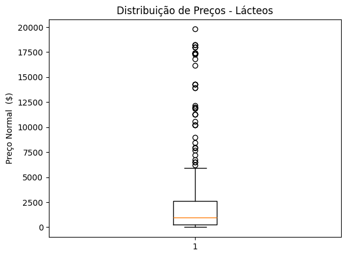
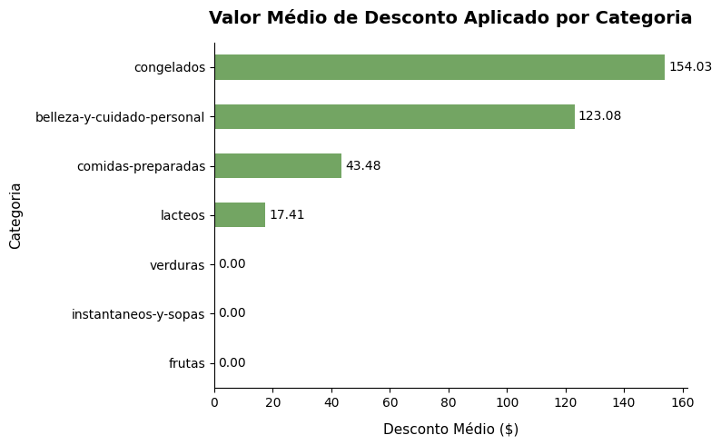

# 🛒 Análise Exploratória de Preços e Descontos no Varejo Supermercadista

Projeto de Análise Exploratória de Dados (EDA) focado na avaliação estatística de políticas de precificação, distribuição de descontos e identificação de anomalias no catálogo de produtos de um supermercado chileno.

---

## 📌 Visão Geral do Projeto

Este projeto tem como objetivo aplicar conceitos de **estatística descritiva** e **visualização de dados** para responder perguntas de negócio essenciais:
- Como se comportam as métricas de tendência central (média vs. mediana) entre categorias?
- Quais categorias apresentam maior variabilidade e dispersão de preços?
- Há presença de valores atípicos (*outliers*) e qual a causa-raiz desses desvios?
- Como estão distribuídos os descontos médios oferecidos por categoria e marca?

---

## 🛠️ Tecnologias e Bibliotecas

- **Python 3.14**
- [**Pandas**](https://pandas.pydata.org/): Tratamento, agregação, mapeamento e cálculos estatísticos.
- [**Matplotlib**](https://matplotlib.org/): Visualizações gráficas estáticas formatadas para *Data Storytelling*.
- [**Plotly Express**](https://plotly.com/python/): Gráficos hierárquicos e interativos (*Treemap*).

---

## 📂 Dicionário de Dados

A base de dados é composta pelas seguintes variáveis:

| Campo | Descrição |
| :--- | :--- |
| `Title` | Nome comercial do produto |
| `Marca` | Marca do fabricante |
| `Categoria` | Categoria de produto (em espanhol) |
| `Preco_Normal` | Preço regular sem aplicação de promoções |
| `Preco_Desconto` | Preço de venda final com desconto |
| `Preco_Anterior` | Preço praticado anteriormente |
| `Desconto` | Valor absoluto monetário do desconto aplicado |

---

## 📊 Análises e Resultados

### 1. Tendência Central e Dispersão dos Preços
- **Assimetria Positiva:** A maioria das categorias (`lacteos`, `congelados`, `belleza-y-cuidado-personal`, `frutas`, `verduras` e `instantaneos-y-sopas`) possui **média consideravelmente superior à mediana**, apontando uma cauda alongada à direita gerada por produtos de alto valor.
- A única exceção observada foi a categoria `comidas-preparadas`, cuja média ficou abaixo da mediana, sugerindo itens pontuais muito baratos puxando a métrica para baixo.
- **Maior Dispersão:** A categoria **`lacteos`** apresentou o maior desvio padrão entre todas as categorias, com a média chegando a **2,4 vezes** o valor da sua mediana.

---

### 2. Diagnóstico de Outliers: Categoria Lácteos

Para investigar o alto desvio padrão em `lacteos`, foi plotado um Boxplot e calculado o limite superior via **Intervalo Interquartil ($IQR = Q_3 - Q_1$)**:

$$\text{Limite Superior} = Q_3 + 1{,}5 \times IQR$$

<p align="center">
  
</p>

#### 🔍 Resumo da Análise do Boxplot:
- **Assimetria Acentuada:** Mediana concentrada na faixa inferior (~$ 989,00), enquanto o terceiro quartil e o limite superior estendem-se significativamente.
- **Detecção de Valores Atípicos:** Foi encontrada uma quantidade expressiva de registros acima do corte de corte do limite superior.
- **Causa-Raiz (Insight de Negócio):** Ao inspecionar os itens de maior preço (ex: leite cadastrado a $ 19.788,00), constatou-se uma **inconsistência no nível de agregação de cadastro**: tratava-se de caixas fechadas / engradados com 12 unidades registrados sob o mesmo campo de itens unitários. A recomendação técnica é a criação de uma métrica de preço normalizado por unidade/litro.

---

### 3. Distribuição dos Descontos Médios por Categoria

Comparativo do volume monetário médio concedido em descontos para cada linha de produtos:

<p align="center">
  
</p>

#### 🔍 Resumo da Análise de Descontos:
- Categorias de ticket médio mais alto ou perecíveis com maior giro de estoque concentram os maiores valores médios absolutos de desconto.
- Categorias básicas como hortifrúti (`frutas` e `verduras`) operam com as menores margens de concessão de desconto médio em valor nominal.

---

### 4. Mapeamento Hierárquico: Categoria x Marca x Volume (Treemap)
- Construção de um *Treemap* interativo com **Plotly Express**, cruzando `Categoria` e `Marca`.
- O tamanho dos blocos representa o volume de sortimento de produtos (`Quantidade_Produtos`), enquanto a escala de cor contínua reflete a agressividade do `Desconto Médio`.

---

## Estrutura do repositório
```text
EBAC-Projeto_3/
├── imagens/
│   ├── boxplot_distribuicao_preco.png
│   └── valor_medio_categia.png
├── analise_estatistica_supermercado.ipynb
├── MODULO7_PROJETOFINAL_BASE_SUPERMERCADO.csv
├── requirements.txt
└── README.md
```

## 🚀 Como Executar o Projeto

1. Clone o repositório:
   ```bash
   git clone https://github.com/AlbertButzke/EBAC-projeto_3.git
   cd seu-repositorio
   ```

2. Crie e ative um ambiente virtual (opcional, mas recomendado):
   ```bash
   python -m venv venv
   # No Windows:
   venv\Scripts\activate
   # No Linux/Mac:
   source venv/bin/activate
   ```

3. Instale as dependências:
   ```bash
   pip install -r requirements.txt
   ```

4. Certifique-se de que o arquivo da base (`MODULO7_PROJETOFINAL_BASE_SUPERMERCADO.csv`) está na raiz do diretório e execute o notebook ou script Python.

---

## 👤 Autor

Desenvolvido por **Felipe Alberto Butzke**  
*Sinta-se à vontade para conectar-se comigo via [LinkedIn](https://www.linkedin.com/in/felipe-alberto-butzke-649986317/) ou abrir uma Issue para sugestões!*